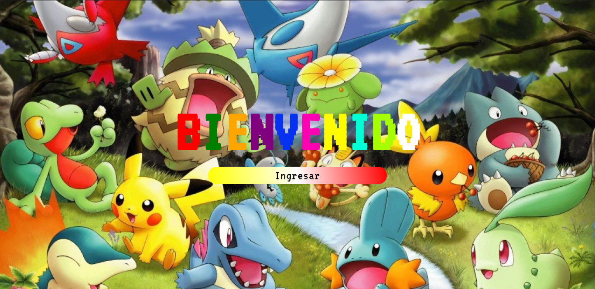
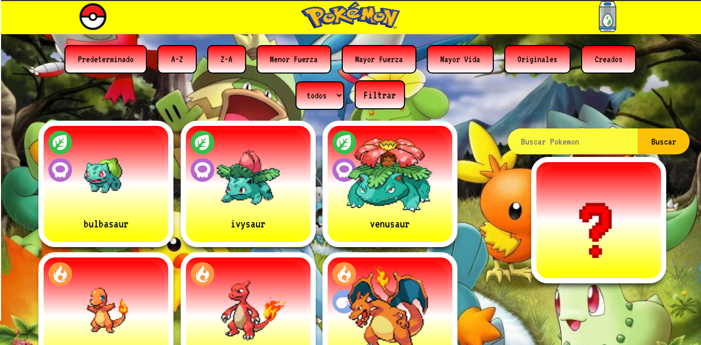
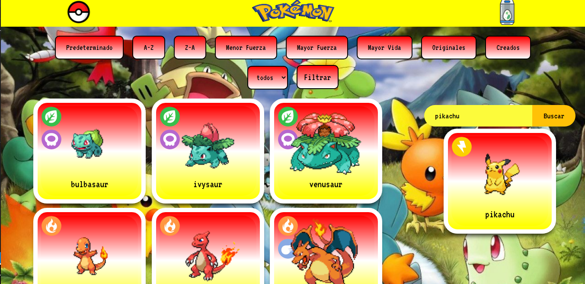
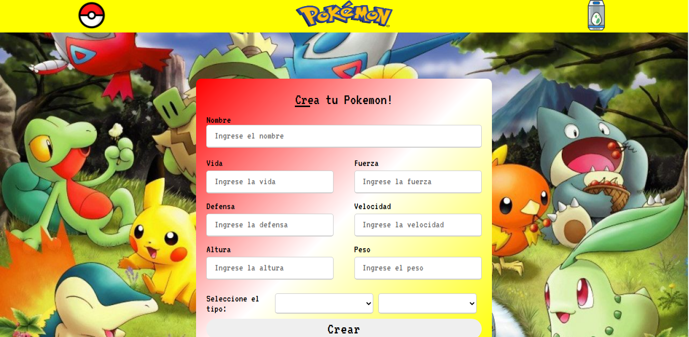

    

# Proyecto Individual - Henry Pokemon

  

  

  

  

## Objetivos del Proyecto

- Construir una App utlizando React, Redux, Node y Sequelize.

La idea general es crear una aplicación en la cual se puedan ver los distintos Pokemon utilizando la api externa [pokeapi](https://pokeapi.co/) y a partir de ella poder, entre otras cosas:

  - Buscar pokemons
  - Filtrarlos / Ordenarlos
  - Crear nuevos pokemons

#### Tecnologías necesarias:
- [ ] React
- [ ] Redux
- [ ] Express
- [ ] Sequelize - Postgres

